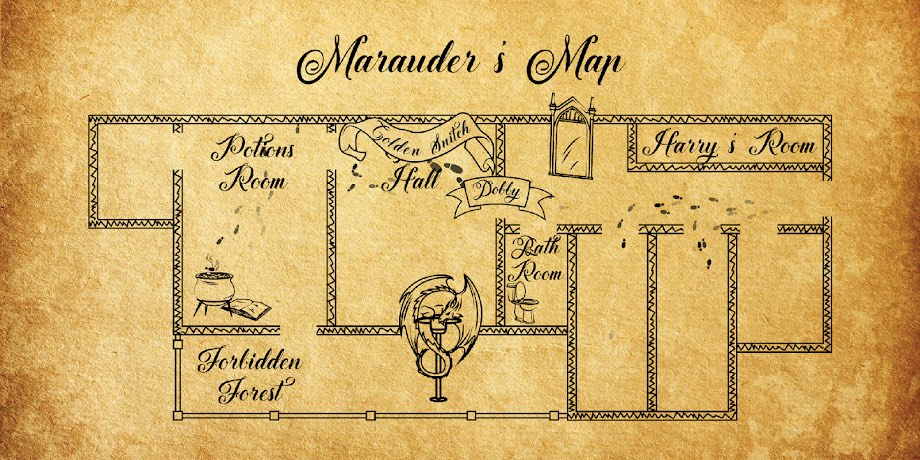

# Marauder's Map

This project was created for a Halloweeen party in 2019. We created an interactive
Marauder's Map inspired by the magical artifact made famous by Harry Potter.

## The Magical Experience
* A digital map that matches the house layout is displayed on multiple screens throughout the house
* Footprints walk randomly between rooms on the map
* People carry magic wands owned by their characters
* When a magic wand taps on specific locations in the house, the name of the character appears in the correct rooms on the maps, and all of the screens are updated simultaneously
* The character walks around for 30 seconds
* The name of the character disappears, but the footsteps continue walking throughout the house

Additional photos and a video demonstration are available in this Google Photos album: https://photos.app.goo.gl/kNvyvE8LKf88RsGLA

# Technical Components

The experience is powered by a web app and an Android app. If you open the website or the Android app, you will see the Marauder's Map. If you touch an NFC tag to the Android app, it launches the NFC section of the app and registers the wand tap in a Firestore Database. The website listens for changes in the Firestore Database and updates the animation to match the wand location.

* [Website README](website/README.md)
  * Displays the map on an HTML5 canvas
  * Moves characters around the map based on a Firestore Database
* [Android README](android/Marauder/README.md)
  * NFC reader publishes wand information to a Firestore Database
  * The app also contains a webview so that Android devices display the HTML5 website
  * The app can be used to display the map on Android TV, Android phones, and Android tablets

*Note*: One of the wands is configured with a "reset" value. When the "reset" wand is used, all of the Android webviews are reloaded. This helps during development, because you can deploy a new website and ensure that all of the Anrdoid devices receive the updated web app in a few seconds, without needing to remove any of the Android devices from their wall-moutned picture frames.

# Party Setup

* Android Displays
  * Install app on Android TV
  * Install app on phones
  * Open the app so that the Android device does not go to sleep
  * Insert phones into picture frames with a power cable and heat ventilation
* Android NFC Readers
  * Use Android phones that support NFC
  * Cover the back side of the phones with cloth so that you cannot see the phones
  * Mark the NFC location on the cloth so that you can tap the NFC reader with a wand
  * Open the app so that the Android device does not go to sleep
* Wands
  * Purchase wooden wands from Etsy
  * Attach NFC tags to magic wands (we used clear Scotch tape)
  * Configure the NFC tags with the proper URI format described in the [Android README](android/Marauder/README.md)
